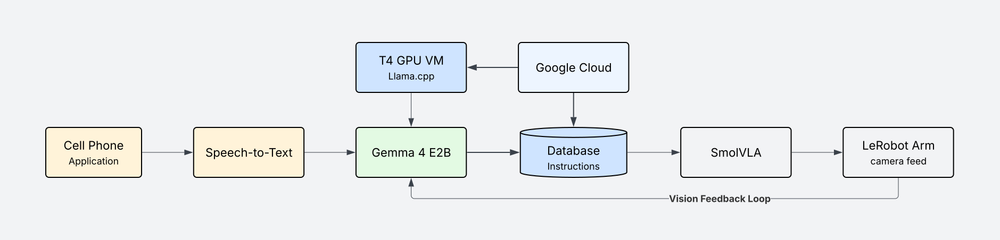
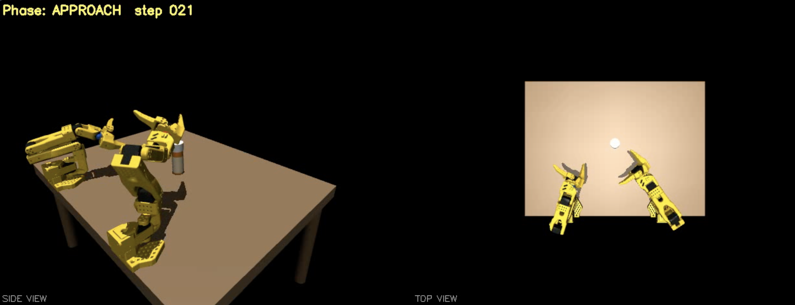

# Gemma Kinetic
  
### Voice-Controlled Assistive Robotics powered by Gemma 4 via llama.cpp
 
---

## Pipeline


--- 

## The Problem

For elderly and disabled individuals, performing basic physical tasks like opening a pill bottle, picking up an object, or pressing a button can be a significant barrier to independence. Existing robotic assistants either require complex interfaces or depend on cloud AI that raises legitimate privacy concerns. A device that is always listening and sending data to a remote server is not something many people want in their bedroom or bathroom.

Gemma Kinetic is a voice-controlled robotic arm assistant that is private by design. All AI inference runs on hardware the user controls. No audio, no video, and no commands leave the system unless explicitly configured to do so.

---

## Gemma 4 Roles

Gemma 4 is the reasoning core of the system. It handles every layer that requires language or visual understanding. SmolVLA handles low-level motor execution — the two layers are intentionally separated so Gemma remains responsible for all interpretation, verification, and correction. There are three distinct integration points:

### 1. Structured Output Generation

The primary role converts a free-form voice transcript into a JSON command with three fields: `task_description`, `object`, and `action`. The system prompt instructs Gemma to respond with valid JSON only — no markdown, no explanation — making the output directly parseable and passable to the robot control layer. A low temperature of 0.2 keeps outputs consistent and deterministic, which matters when commanding hardware.

A typical exchange:

- **Voice input:** *"Can you open the water bottle for me, the lid is pretty tight"*
- **Gemma output:**

```json
{
  "task_description": "locate the water bottle, apply firm counterclockwise rotational force to unscrew the cap",
  "object": "water bottle cap",
  "action": "unscrew"
}
```

This shows how Gemma interprets nuance. The user said "pretty tight" and Gemma translated that into "apply firm rotational force", encoding the physical constraint into the instruction without any explicit mapping.

---

### 2. Vision-Based Gripper Alignment Feedback

The second role uses Gemma 4's native multimodal capability as a closed-loop correction layer. After the arm moves to its initial position, a camera frame is passed to Gemma along with a structured prompt asking it to verify alignment before the action is executed. This prevents errors from accumulating — the arm checks with Gemma before it commits to a grasp.

A typical vision feedback exchange:

- **Camera frame:** gripper positioned ~2cm left of target object
- **Gemma vision prompt:** *"Is the gripper aligned with the bottle cap? Respond only with valid JSON: `{\"aligned\": bool, \"correction\": string, \"confidence\": float}`"*
- **Gemma output:**

```json
{
  "aligned": false,
  "correction": "shift right 2cm",
  "confidence": 0.91
}
```

The correction string is parsed and converted into a delta movement command before the grasp is attempted. On a confirmed `aligned: true`, the arm proceeds. This loop runs until alignment is confirmed or a retry threshold is hit, at which point the system prompts the user for clarification.

The same model — same weights, same endpoint — handles both the text-to-JSON role and this vision verification role. No second model or separate vision pipeline is needed.

---

### 3. Sim-to-Real Pretraining via Gemma-Conditioned Demonstrations

Two SO-101 arms are rendered in MuJoCo to accelerate real-world policy learning.



The key design decision here is that the simulated environment is driven by the same Gemma 4 structured outputs used in production. During pretraining, every motor trajectory in simulation is generated from a Gemma JSON command — not a hand-coded script or generic action label. This means SmolVLA learns motor policies that are natively conditioned on Gemma's language representations from day one, rather than learning from abstract action primitives that must be bridged to language at inference time.

The pretraining loop:

1. A task description is passed to Gemma → structured JSON output is generated
2. The JSON command drives the simulated SO-101 arm through MuJoCo
3. The resulting trajectory is recorded as a demonstration
4. SmolVLA trains on `(Gemma JSON, trajectory)` pairs

When the policy transfers to the physical arms, it already speaks Gemma's language. The sim-to-real gap shrinks because the language conditioning is consistent across both environments.

---

## Impact

The natural language interface lowers the barrier to entry significantly. A user does not need to learn a custom interface or remember specific commands. They describe what they want in plain language and the system handles the mechanics.

The secondary impact is the dataset the system generates. Every voice command paired with its structured Gemma output, vision correction loop, and resulting arm execution creates a record of physical intent mapping: how diverse users describe physical tasks, how a language model interprets those descriptions, what visual corrections are needed, and what motor actions result. This data has direct value for improving both the language-to-action translation layer and the vision feedback loop over time. It is the kind of dataset that does not exist at scale and that robotics researchers actively need.

---

## Why These Technical Choices

**Gemma 4 E2B over larger models.** The E2B model hits a practical sweet spot: strong enough instruction following for reliable structured output, efficient enough to run quantized on a T4 without saturating the GPU, and natively multimodal so the same model handles text-to-JSON, vision feedback, and sim pretraining conditioning. A larger model would improve output quality marginally but would make deployment on accessible hardware significantly harder.

**llama.cpp over hosted inference.** The privacy-first constraint is non-negotiable for the target use case. Elderly and disabled users in residential settings should not have their voice commands and camera feeds routed through a third-party API. llama.cpp makes on-premise inference practical without dedicated ML infrastructure.

**SmolVLA over manual policy training.** Training a robot policy from scratch requires significant hardware, data collection time, and domain expertise. SmolVLA provides a capable pretrained base that accepts natural language task conditioning and integrates directly with Gemma's output format. SmolVLA handles low-level motor execution; Gemma 4 handles all language understanding and visual verification. Fine-tuning SmolVLA on Gemma-conditioned sim demonstrations is the natural production path from the current pretraining setup.

**Flutter for the mobile client.** A single codebase targeting iOS natively, using platform speech recognition, and communicating via standard HTTP kept the mobile layer thin and the inference layer independent. The hold-to-record interaction pattern is intentional: it avoids any always-listening behavior, consistent with the privacy design of the overall system.

---

## Setup

### GCP VM (llama.cpp server)

```bash
/home/llama.cpp/build/bin/llama-server \
  -m /home/models/google_gemma-4-E2B-it-Q4_K_M.gguf \
  --port 8080 \
  --host 0.0.0.0
```

### Laptop (Flask server)

```bash
cd gemmahack
python3 server.py
```

### Flutter app

Add a `.env` file to `gemmaflutter/` with:

```
VM_EXTERNAL_IP=your_gcp_ip
LOCAL_IP=your_laptop_ip
```

Then run via Xcode on iPhone. Requires Xcode installed.
